<br/>
<br/>

<div align="center">

<h3>키키키 (KEY KEY KEY)</h3>
</div>

> 프로젝트 이름 '키키키(keykeykey)'는 한글 채팅으로 웃음을 의미하는 'ㅋ'과 키보드를 뜻하는 영단어 keyboard의 'key'의 음성어를 합쳐서 <strong>"행복하게 코딩하자"</strong>라는 의미를 담았고, 로고는 'ㅋ'이 새겨진 키보드 모양을 표현했습니다.

<br>

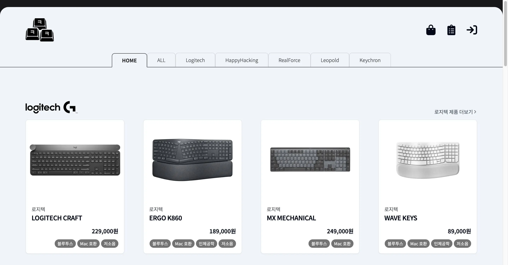
[키키키 - 개발자 키보드 전문 스토어](https://keykeykey.store)
<br>
<br>

## 프로젝트 소개

TypeScript, React 등 프론트엔드 기술들을 활용한 개인 사이드 프로젝트입니다. 개발자들이 선호하는 키보드 브랜드의 제품을 판매하는 온라인 키보드 쇼핑 웹 서비스를 주제로 정하고 구현하고 싶은 기능들을 개발중입니다. <br><br>

<strong>테스트 계정 (ID/PW)</strong>

- 사용자 : `test123@test.com` / `qwer1234@@`
- 관리자 : `admin@master.me` / `qwer1234@@`

<br>

## 기술 스택


<br>


<br>


<br>

## 성능 최적화

#### 번들사이즈 최적화 및 성능 개선

- LightHouse 성능 점수 91점 → 97점 개선
- FCP/LCP 0.4초 단축, 빌드 시간 48%감소
- Vite Bundle Analyzer를 사용하여 번들 사이즈 시각화 및 크리티컬 리소스 식별
- 동적 import, rollup 적용
- 업로드 이미지를 webp 파일로 압축,변환해 최적화

#### 렌더링 최적화 및 UX 향상

- React DevTools Profiler를 사용한 컴포넌트 렌더링 성능 분석
- React.memo를 활용해 불필요한 리렌더링 방지
- React.lazy, Suspense, useSuspenseQuery를 활용해 UX 향상

## 주요 기능

<details> <summary style="font-weight:bold">로그인 / 회원가입</summary><br/><p>로그인</p>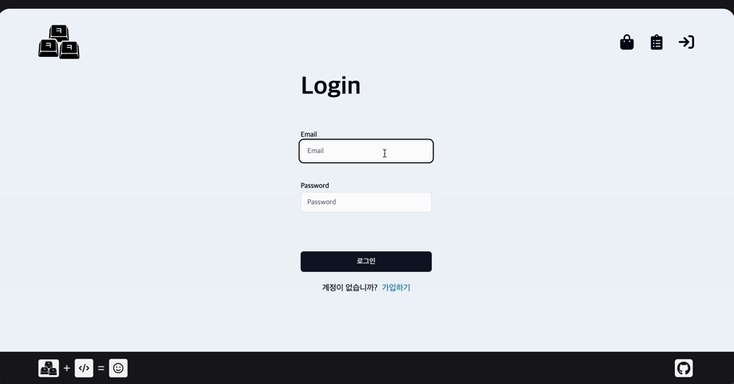<br/> <br/> <p>회원가입</p>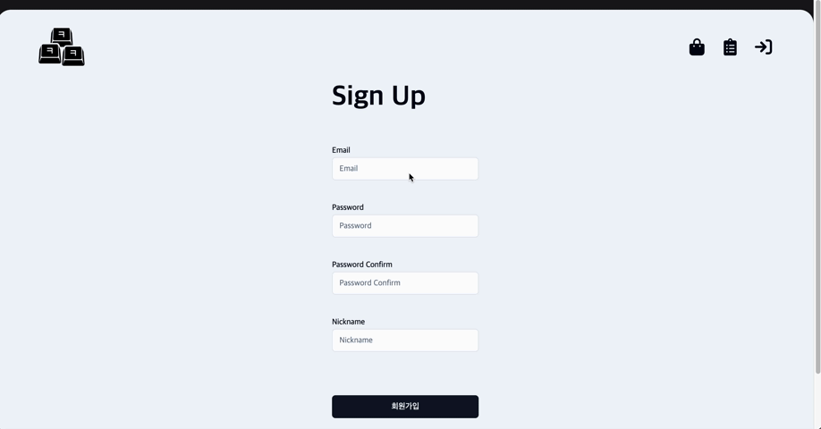</details>

- 정규식 표현, React Hook Form을 활용해 입력값 유효성 검증
- 로그인 후 전역상태로 회원 정보 관리

<details> <summary style="font-weight:bold">상품 조회</summary><br/>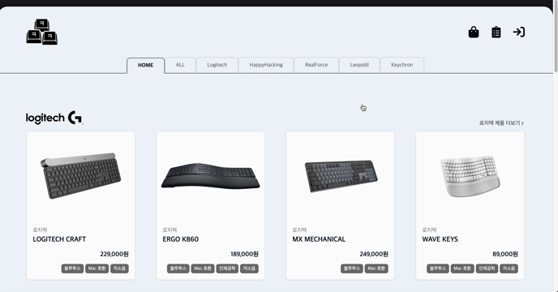<br/></details>

- 무한스크롤을 활용한 페이지네이션
- 최신순, 가격순으로 정렬 기능
- 이미지 캐러셀을 활용한 상품 이미지 전환

<details> <summary style="font-weight:bold">[구매자] 장바구니</summary><br/>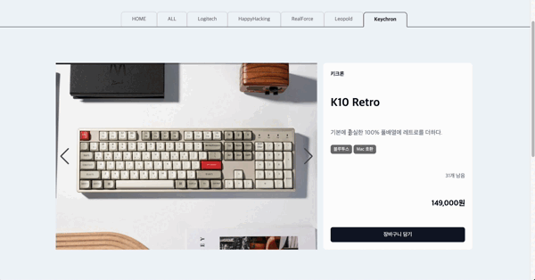<br/></details>

- 장바구니 추가, 수정, 삭제 기능
- Zustand의 persist를 활용해 세션스토리지에서 장바구니 데이터 관리

<details> <summary style="font-weight:bold">[구매자] 상품 주문 / 주문 내역</summary><br/><p>상품 주문</p>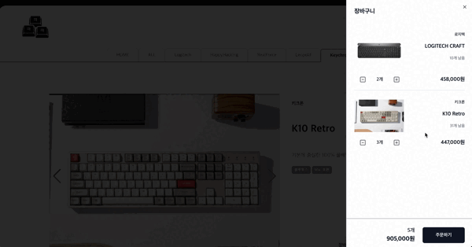<br/><br/><p>주문 내역</p>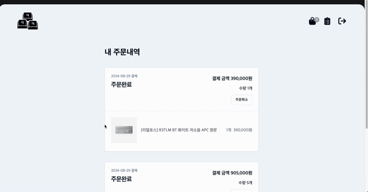</details>

- 토스 결제 SDK를 활용한 가상 결제 기능
- 주문 내역 확인 및 주문 취소 기능

<details> <summary style="font-weight:bold">[판매자] 상품 관리</summary><br/><p>상품 등록</p><br/><br/><p>상품 수정</p>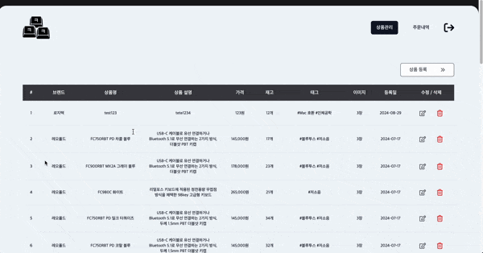<br/><br/><p>상품 삭제</p>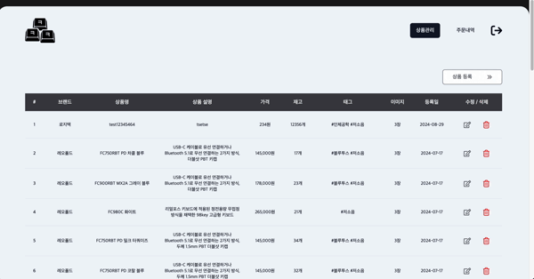</details>

- 상품 등록, 수정, 삭제 기능
- zod, React Hook Form을 활용해 입력값 유효성 검증

<details> <summary style="font-weight:bold">[판매자] 주문 관리</summary><br/>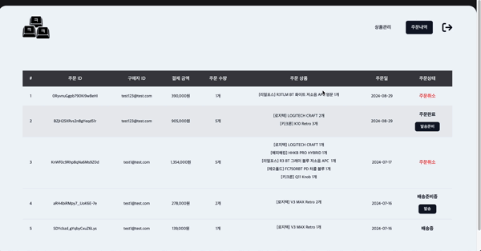<br/></details>

- 주문 내역 확인 및 배송 상태 변경

## 폴더 구조

```text
📂src
 ┣ 📂assets      // 로고, 배경 이미지 파일
 ┣ 📂enum        // enum 파일
 ┣ 📂interfaces  // interface 파일
 ┣ 📂lib         // 기타 로컬 데이터 파일
 ┣ 📂hooks       // 커스텀 hooks 파일
 ┣ 📂queries     // react-query의 useQuery hooks 파일
 ┣ 📂store       // zustand의 store hooks 파일
 ┣ 📂router      // react-router의 router 파일
 ┣ 📂components  // header,nav,cart,form 등 UI 컴포넌트 파일
 ┃ ┗ 📂...
 ┗ 📂pages       // 유저 타입 별 페이지 컴포넌트 파일
   ┣ 📂admin
   ┃ ┗ 📂...
   ┣ 📂common
   ┃ ┗ 📂...
   ┗ 📂user
     ┗ 📂...
```

## Git 컨벤션

### 브랜치 컨벤션

- main : 최종 배포버전에 이상이 없을 시 deploy브랜치에서 pull 받음
- opt : 기본 기능 작업 외 추가적인 성능 최적화 작업 등
- deploy
  - dev브랜치에서 최종 작업 버전을 pull 받음
  - 수정되는 배포 버전만 올리기 위한 용도
  - 배포 버전이 이상없을 시 main으로 push
- dev
  - 최초 clone 후 환경세팅, 완료되면 feature 브랜치로 체크아웃
  - feature 브랜치에서 작업 완료된 기능을 push 받음, 다시 기능별 분기
  - 테스트가 완료 후 배포 버전 deploy로 push
- feat/{요구사항명}
  - feat/auth, feat/order …
  - 요구사항 기능 단위로 생성해 작업
  - 해당 작업이 완료되면 dev로 push

### 커밋 컨벤션

커밋 시 템플릿을 생성해 커밋 메세지의 type, title, body를 입력하게함

```text
# Commit Template
#####################
# Commit Title
# [커밋 타입] 커밋 제목

# Commit Body
# 커밋 설명
#####################
```

커밋 타입

- feat : 기능 로직 작업
- fix : 버그 수정 작업
- design : 뷰 로직 작업
- opt : 최적화, 리팩토링 작업
- test : 테스트 작업
- deploy : 배포 작업
- env : 환경 세팅, 라이브러리 추가 등
- doc : 기타 문서 작업 등

## 와이어프레임, 유저플로우

> 디자인 툴 : miro <br> [결과물 링크](https://miro.com/app/board/uXjVK6Caq5o=/?share_link_id=586957999401)

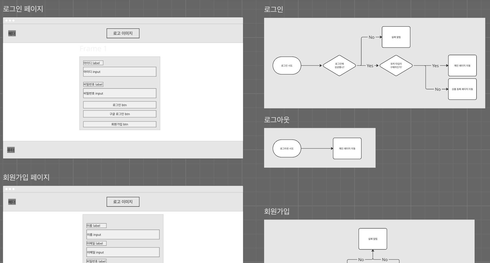
