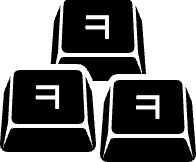

&nbsp;

 
 

<h3>키키키 (KEY KEY KEY)</h3>

> 프로젝트 이름 '키키키(keykeykey)'는 "행복하게 코딩하자"라는 의미로 한글 채팅으로 웃음을 의미하는 'ㅋ'과 키보드를 뜻하는 영단어 keyboard의 'key'의 음성어를 합쳐서 표현했고, 로고는 'ㅋ'이 새겨진 키보드 모양을 표현했습니다.

 

#### 프로젝트 소개

개발자들이 선호하는 키보드 브랜드의 제품을 판매하는 키보드 쇼핑 웹 서비스입니다. 

#### 테스트 계정 (ID/PW)

- 유저 : `test1@test.com` / `qwer1234@@`
- 관리자 : `admin@master.me` / `qwer1234@@`

#### 배포 링크

[키키키 - 개발자 키보드 전문 스토어](https://keykeykey.store)
 

## 기술 스택

 

 

 

 

